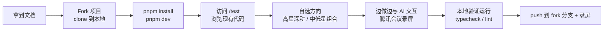

# 前端开发能力测试 · 任务说明书

> 基于 [AIRI / proj-airi](https://github.com/moeru-ai/AIRI) 的 stage-web 裁剪，遵循原项目 MIT License。
>
> **面试须知已并入本文档，不再单独提供 INTERVIEW_NOTES。**

---

## 30 秒速览

| 项目 | 说明 |
|------|------|
| **你是谁** | 候选人，带一台能开腾讯会议的电脑 |
| **给多久** | **60 分钟**，全程自由分配时间 |
| **做什么** | 在一个已跑起来的测试页面（`/test`）上，**自由挑选方向做功能**；可以 review 代码、写 feature、调体验、补测试——任选 |
| **怎么验收** | 代码可运行 + 腾讯会议录屏（重点看你怎么与 AI 助手交互） |

**关键词：自由发挥。** 下方任务池是「实现方向的示例」，不是必考清单；星值只是「打分权重参考」。你可以挑 1 个高星深耕，也可以组合若干中低星，甚至做任何你觉得在这个测试页面上值得做的功能。

---

## 开始之前：录屏要求（必需）

本次测试**必须录制屏幕**，形式为**腾讯会议录屏**（共享屏幕 / 会议录制均可）。

**录屏不是走形式——考官会回放，重点观察你「如何与 AI 助手交互」：**
- 你怎么把需求拆成可执行的问题向 AI 提问？
- 你是否会**主动阅读、验证 AI 产出的代码**，还是盲目接受？
- 发现 AI 遗漏或写错时，你怎么定位、怎么引导它修正？
- 你的返工节奏是否合理：有效利用 AI 提速，而不是被它牵着走。

**建议**：打开一个 AI 助手（ChatGPT / Claude / Cursor 等）放在屏幕可见区域，让录屏能清晰 capture 到对话与代码的来回过程。

---

## 三件事（建议你做，但不强制按顺序）

### 1. 先看代码，再动手（推荐，不占强制时间）
测试页面和组件已经能跑起来。建议你花 5–10 分钟浏览 `apps/stage-web/src/components/`、`pages/`、`stores/` 里的代码，看看现有实现和 TODO，再决定做哪个方向。

### 2. 在 /test 页面上自由发挥（核心）
- 启动后访问 http://localhost:5173/test（聊天 / 输入 / 状态组件都在这）
- 若选「记忆配置」相关方向，请访问 http://localhost:5173/settings/memory（独立路由）
- 下方「任务池」列出了 9 个示例方向，每个都标注了「完成度」和「星值」
  - **「已就绪，可扩展打磨」**：脚手架已搭好，TODO 明确，适合在此基础上做深做细
  - **「从零添加」**：目前几乎是空白页，适合喜欢从 0 到 1 的候选人
- 你可以只选 1 个高星（★★★★☆/★★★★★）深入做透；也可以组合 2–3 个中低星做「面」；也可以做任务池之外、但你觉得有价值的功能。

### 3. 提交（时间到即停）
- 代码提交到 **你 fork 的仓库上的新分支**（建议 `feat/xxx`），并 push 到远端
- 录屏文件按约定命名/存放
- 建议用 `REVIEW.md` 或 commit message 简单写几句你做了啥、为什么这么做——帮助考官快速理解你的思路

---

## 快速开始

环境要求：Node.js >= 20，pnpm >= 9

> **动手前先 Fork**：先点仓库右上角 **Fork**，把项目复制到自己的 GitHub 账号；再 clone **你 fork 的仓库** 到本地，后续所有改动都发生在你自己 fork 的仓库上。

```bash
# 0. 克隆你 fork 的仓库
# git clone <你的 fork 仓库地址>

# 1. 安装依赖
pnpm install

# 2. 启动开发服务器（端口 5173）
pnpm dev

# 3. 访问测试页面
# http://localhost:5173/test

# 4. 类型检查（推荐在提交前跑一遍）
pnpm -F @proj-airi/stage-web typecheck

# 其他常用命令
pnpm -F @proj-airi/stage-web lint
pnpm -F @proj-airi/stage-web build
```

> ⚠️ 注意：`pnpm type-check`（tsc --noEmit）不覆盖 .vue 文件；stage-web 的正确类型检查命令是上面的 `pnpm -F @proj-airi/stage-web typecheck`（基于 vue-tsc）。

---

## 任务池：实现方向示例

> ★ = 打分权重参考（五星权重最高），**不是必须完成的清单**。完成度 = 当前代码脚手架状态，供你参考选题。

### 聊天与多模态

| 子项 | 星值 | 主要文件 | 完成度 |
|------|------|----------|--------|
| 多模态输入整合 | ★★★★★ | `InputControls.vue` | **已就绪，可扩展打磨** —— 语音触发、图片上传预览、输入态切换的骨架已齐，仅剩零星 TODO |
| 消息流体验 | ★★★★☆ | `ChatInterface.vue` | **已就绪，可扩展打磨** —— 消息气泡、自动滚动等基础链路已通，可继续优化体验与边界 |
| 输入状态指示 | ★★★☆☆ | `StatusIndicator.vue` | **已就绪，可扩展打磨** —— 发送中/上传中/录音中的状态可视化已有雏形，可补全动画与联动 |
| 表情插入与文本发送 | ★★☆☆☆ | `ChatInterface.vue` | **已就绪，可扩展打磨** —— 表情面板与基础发送链路已接入，可打磨交互细节 |

### 配置与偏好

| 子项 | 星值 | 主要文件 | 完成度 |
|------|------|----------|--------|
| 记忆配置可靠性 | ★★★★☆ | `settings/memory/index.vue` | **从零添加** —— 目前仅一行 `<WIP />` 占位，完全空白 |
| 用户偏好持久化 | ★★★☆☆ | `stores/settings.ts` + `test.vue` | **已就绪，可扩展打磨** —— 主题切换与本地存储同步已有基础，可补全响应式与边界 |
| 配置表单可用性 | ★★☆☆☆ | `settings/memory/index.vue` | **从零添加** —— 同上，真空白，需自行设计表单分组、校验与提示 |

### 状态可视化

| 子项 | 星值 | 主要文件 | 完成度 |
|------|------|----------|--------|
| 助手状态展示 | ★★★☆☆ | `StatusIndicator.vue` | **已就绪，可扩展打磨** —— 在线/思考/响应/离线的颜色编码已有框架，可补全过渡动画 |
| 状态数据接入 | ★★☆☆☆ | `StatusIndicator.vue` | **已就绪，可扩展打磨** —— 从 store 读取状态并驱动 UI 的链路已通，可补全空态与错误保护 |

---

## 我们会怎么给你打分

以下维度没有硬性及格线，而是「你做得越好，得分越高」的标尺：

| 维度 | 看什么 |
|------|--------|
| **功能完成度** | 你选的方向是否跑通了核心链路？边界情况（空态、错误、超限）有没有处理？ |
| **代码质量** | TypeScript 类型是否完整；组件职责是否清晰；命名是否语义化；有无冗余/死代码 |
| **用户体验** | 交互反馈是否即时；动画/状态可视化是否自然；移动端是否可用；是否有基础可访问性意识 |
| **工程习惯** | 是否做了最小自测；错误提示是否友好；是否遵循现有约定（UnoCSS / Pinia / Vue 3 组合式 API） |
| **与 AI 的交互质量** | 录屏回放重点：提问质量、校验意识、纠错与返工节奏、是否被 AI 牵着走 |

---

## 提交清单

- [ ] `pnpm install` 成功
- [ ] `pnpm dev` 启动成功，http://localhost:5173/test 可访问
- [ ] 已实现的功能在 /test 或对应页面上可运行
- [ ] `pnpm -F @proj-airi/stage-web typecheck` 无类型错误
- [ ] 代码已提交到你 fork 的仓库分支并 push 到远端（`git status` 无未提交文件）
- [ ] 已产出简要说明（`REVIEW.md` / commit message / `SELF_REVIEW.md` 均可）
- [ ] **已录制腾讯会议录屏**，且能清晰看到与 AI 助手的交互过程

---

## 候选人流程图



---

## 技术栈速查

- **框架**: Vue 3 Composition API + TypeScript + Vite
- **状态**: Pinia
- **样式**: UnoCSS（原子化 CSS）
- **包管理**: pnpm + Turbo（Monorepo）

---

## License

本项目基于 [AIRI (proj-airi)](https://github.com/moeru-ai/AIRI) 裁剪，遵循原项目 MIT License。
